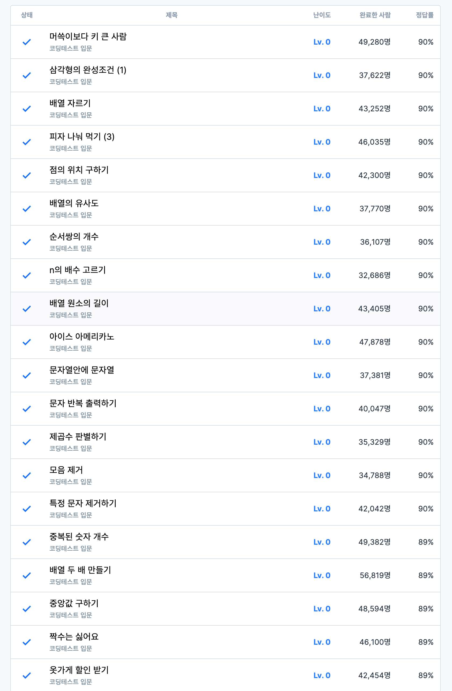

# 코요테 2주차

## 1. 어려웠던 부분/문제

- 생각보다 어려웠던 문제들이 있었음.
- 정답률이 90%인데 어려운 지점이 있었다는 게 자괴감이 듬.

## 2. 새롭게 알게 된 점

### slice 배열 메서드 (자르고 배열 복사)
- 배열의 일부분을 잘라 "새로운 배열"로 반환
- 원본 배열은 변경되지 않음

```js
array.slice(start, end);
```

- start: 시작 인덱스 (포함)
- end: 끝 인덱스 (미포함)
- 둘 다 생략시 전체 배열 복사

### splice 배열 메서드 (자르고 원본 수정)
- 배열의 특정 구간을 잘라내거나 잘라내고 새로운 요소 삽입가능까지 가능
- 원본 배열을 변경

```js
array.splice(start, deleteCount, item1, item2, ...);
```

- start: 수정 시작 인덱스
- deleteCount: 제거할 요소 개수
- item: start 위치에 새로 넣을 요소(옵션)

### repeat() 메서드
- 문자열을 주어진 횟수만큼 반복해 붙인 새로운 문자열을 반환합니다.

```js
str.repeat(count);
```
- count : 문자열을 반복할 횟수. 0과 양의 무한대 사이의 정수.
- 반환값 : 현재 문자열을 주어진 횟수만큼 반복해 붙인 새로운 문자열.

### Math.sqrt(Number)
- 숫자의 제곱근을 반환합니다.
- ex. Math.sqrt(9) => 3

### Number.isInteger(value)
- value : 정수인지 확인하려는 값.
- 주어진 값이 정수라면 불리언 값 true, 그렇지 않으면 false 입니다.

<br>

## 3. 궁금한 점

- 부캠 중 자신만의 멘탈 관리법

## 4. 풀면서 느낀 점

- slice, splice 이름도 비슷해가지고 헷갈렸음.
- 하루를 48시간 살고 싶다.
- 조금만 젊었어도 금방 푸는건데 청춘이 그립다. (젊을 때가 좋았다)

## 5. 문제 풀이 인증 (풀이 완료화면 스크린샷)

```js
// 삼각형의 완성조건 (1)
function solution(sides) {
  const sortedSides = sides.sort((a, b) => b - a);
  return sortedSides[0] < sortedSides[1] + sortedSides[2] ? 1 : 2;
}

// 배열 자르기
function solution(numbers, num1, num2) {
  var answer = numbers.slice(num1, num2 + 1);
  return answer;
}

// 피자 나눠먹기 (3)
function solution(slice, n) {
  return Math.ceil(n / slice);
}

// 점의 위치 구하기 (정직하게 풀어버림)
function solution(dot) {
  // [양수, 양수] : 1
  // [양수, 음수] : 4
  // [음수, 양수] : 2
  // [음수, 음수] : 3

  if (dot[0] > 0 && dot[1] > 0) return 1;
  if (dot[0] > 0 && dot[1] < 0) return 4;
  if (dot[0] < 0 && dot[1] > 0) return 2;
  if (dot[0] < 0 && dot[1] < 0) return 3;
}

// 점의 위치 구하기 다른사람풀이 (구조분해할당 방식)
function solution(dot) {
  const [num, num2] = dot;
  const check = num * num2 > 0;
  return num > 0 ? (check ? 1 : 4) : check ? 3 : 2;
}

// 배열의 유사도 (콜백헬 느낌으로 풀음 (이중 반복문))
function solution(s1, s2) {
  let ans = 0;

  s1.forEach((v1) => {
    s2.forEach((v2) => {
      if (v1 === v2) {
        ans++;
      }
    });
  });

  return ans;
}

// 순서쌍의 개수 (모든 수를 대입하는 비효율 끝판왕 방법, 더 좋은 방법 모르겠음)
function solution(n) {
  let count = 0;
  for (let i = 0; i <= n; i++) {
    if (n % i === 0) {
      count++;
    }
  }
  return count;
}

// 배열 원소의 길이 (각 배열의 길이를 push해서 반환)
function solution(strlist) {
  const ans = [];
  strlist.forEach((v) => ans.push(v.length));
  return ans;
}

// 아이스 아메리카노 > 그냥 품
function solution(money) {
  return [parseInt(money / 5500), money % 5500];
}
// parseInt 함수는 첫 번째 인자를 문자열로 변환하고, 그 값을 파싱하여 정수나 NaN을 반환합니다.

// 문자열 안에 물자열
function solution(str1, str2) {
  return str1.includes(str2) ? 1 : 2;
}

// 문자 반복 출력하기 >> 이것 좀 어려웟음
function solution(my_string, n) {
  const ans = [];

  // 문자열을 하나씩 쪼갠다.
  const splitString = [...my_string];

  // 각 문자열마다 * n 을 한다?? > 이걸 어떻게 하냐
  splitString.forEach((_, k) => {
    for (let i = 0; i < n; i++) {
      ans.push(splitString[k]);
    }
  });

  // 합쳐서 반환한다.
  return ans.join("");
}

// 제곱수 판별하기 >> 이건 그냥 그럼
function solution(n) {
    return Number.isInteger(Math.sqrt(n)) ? 1 : 2
}

// 모음 제거 > 이것도 코드가 마음에 안듬.
function solution(my_string) {
        
    const a = [...my_string].filter((v, i) => {
        return v !== 'a' && v !== 'e' && v !== 'i' && v !== 'o' && v !== 'u';
    })
    
    return a.join('');
}

// 특정 문자 제거하기. > replaceAll이라 빨리 품
function solution(my_string, letter) {
    return my_string.replaceAll(letter, '')
}

// 배열 두 배 만들기 >> 바로 맵 메서드 떠올라서 5초 만에 풀어버림.
function solution(numbers) {
    return numbers.map((v) => v * 2)
}

// 중앙값 만들기 > 코드가 이상함
function solution(array) {
     const a = array.sort((a, b) => b - a) // 먼저 내림차순 정렬하고
     return a[Math.ceil(a.length/2) - 1] // 배열 길이의 절반에다가 -1 해서 중앙값 구함.
}

// 짝수는 싫어요 > 효율적인 코드가 아닌 거 같음
function solution(n) {
    var answer = [];
    
    for(let i = 1; i <= n; i++){
        answer.push(i); // n 보다 작은 배열을 만드는 과정
    }
    
    const a = answer.filter((v) => { // 필터로 홀수 인 것만 조건문으로 필터링
        if( v % 2 !== 0){
            return v;
        } 
    })
    
    return a; // 반환
}

// 옷 가게 할인 받기 > 계속 2개만 실패하니깐 짜증나서 소수점 전체로 버려버림.
function solution(price) {
    // 10만워 이상 5% 할인
    // 30만원 이상 10% 할인
    // 50만원 이상 20% 할인    
    if(price >= 500000){
        return parseInt(price - ((price / 100) * 20))
    }
    
    if(price >= 300000){
        return parseInt(price - ((price / 100) * 10))
    }
    
    if(price >= 100000){
        return parseInt(price - ((price / 100) * 5))
    }
    
    return price;
}

```

## 6. 산뜻한 코드

```js
// 배열 원소의 길이 > 왜 map인지 모르겠음.
function solution(strlist) {
  return strlist.map((el) => el.length);
}
// 리뷰 : 문제 읽어보고 문제가 `map 아세요?` 라는 거 같았습니다. ㅋㅋㅋ
// >> 왜 map 아세요 라는 문제인걸까?

// 문자열 안에 문자열 > indexOf 찾기 신박
function solution(str1, str2) {
  return str1.indexOf(str2) === -1 ? 2 : 1;
}

// 문자 반복 출력하기 > Repeat 메서드 신박
function solution(my_string, n) {
  var answer = [...my_string].map((v) => v.repeat(n)).join("");
  console.log(answer);
  return answer;
}

// 모음 제거 > 정규표현식 신박
function solution(my_string) {
    return my_string.replace(/[aeiou]/g, '');
}
```
## 인증샷

